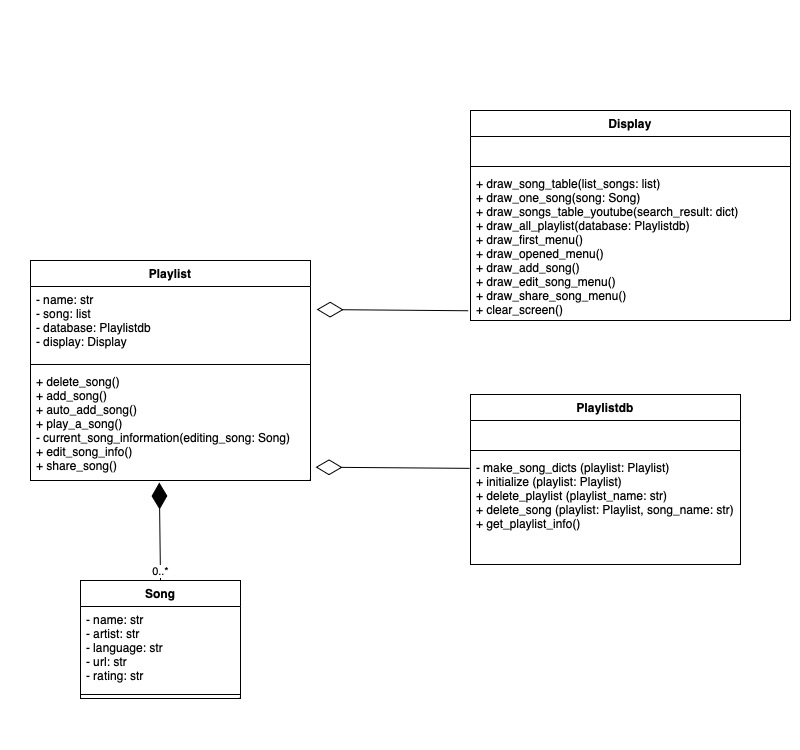

# Super Duper Playlist

This program is a part of the 01219114 and 01219115 Computer Programming 1 course.

Super Duper Playlist is a program for managing your own playlist on offline platform.

GitHub of the project `https://github.com/ReggieReo/Super-Duper-Playlist`

## Overview
***
The Program will read playlist information in playlists.json file, if the file is not made yet. The program will create playlists.json without any playlist init.  
User can freely create, delete, or open the playlist. After the user open a playlist the additional menu will show up.

### Example of menu
- See all playlist
- Open a playlist
  - Play a song
  - Add a song
  - Delete songs
  - Edit song's information
  - Get song's information
- Create a new playlist
- Delete a playlist

***
##  Features


### See all playlist
* Program will display all the playlist that are saved in playlist.json  


### Create a new playlist
* Program will let the user create a playlist  


### Delete a playlist
* Program will let the user delete a playlist  


### Open a playlist
* Program will let the user choose to open one playlist, and the additional menu will appear.  
  
  

  - Play a song: Play the selected song from the playlist, and open it on the browser.
  - Add a song: Add the songs to the playlist.
  - Delete songs: Delete a songs in the playlist.
  - Edit song's information: Edit a chosen song's information.
  - Get song's information: Share a song or all songs' information.

## Required libraries and tools
*** 
`prettytable~=3.5.0` for drawing a table for menu and information.  
`youtube-search~=2.1.2` for searching a song for adding to the playlist  

Install the requirements by
```
pip install -r requirements.txt
```
or
```
pip3 install -r requirements.txt
```

## Program design
***

There are 4 classes in this program.  
* Song: This class contains all song's information
* Playlist: This class contain a list of Song class. Containing the main method for running the program.
* Playlistdb: This class is used for writing and reading the playlist file, which is playlist.json.
* Display: This class is used for drawing a table for menu, and information.  



## Code structure
***

* song.py: This file contains Song class.
* playlist.py: This file contains Playlist class.
* playlist_database.py: This file contains Playlistdb class.
* display.py: This file contains Display class.
* main.py: This file is used for running the program.
* playlists.json: This file is used for saving playlists.