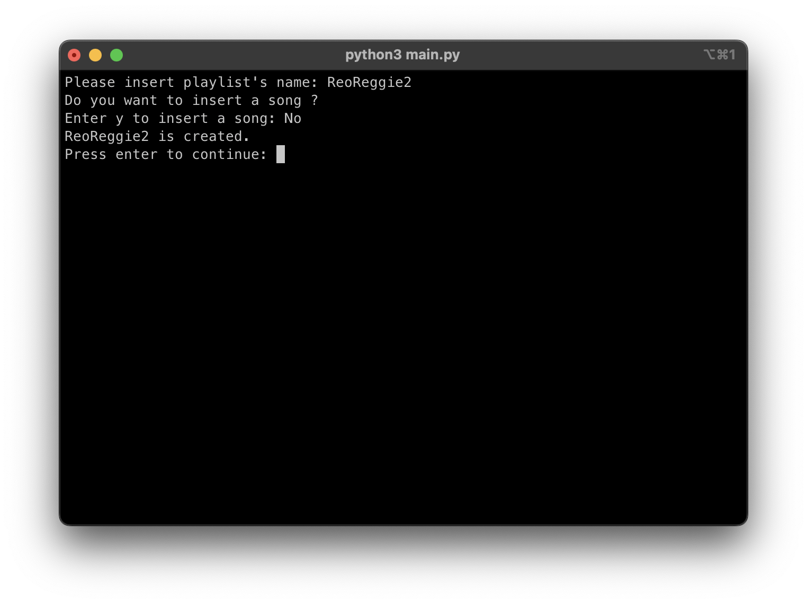
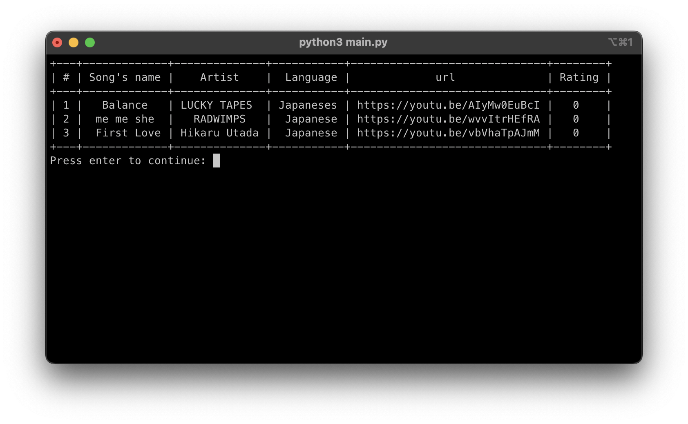

# Super Duper Playlist
***
This program is a part of the 01219114 and 01219115 Computer Programming 1 course.

Super Duper Playlist is a program for managing your own playlist on offline platform.

## Overview
***
The Program will read playlist information in playlists.json file, if the file is not made yet. The program will create playlists.json without any playlist init.  
User can freely create, delete, or open the playlist. After the user open a playlist the additional menu will show up.

### Example of menu
- See all playlist
- Open a playlist
  - Play a song
  - Add a song
  - Delete songs
  - Edit song's information
  - Get song's information
- Create a new playlist
- Delete a playlist

***
##  Features
 

### See all playlist
* Program will display all the playlist that are saved in playlist.json

### Create a new playlist
* Program will let the user create a playlist

### Delete a playlist
* Program will let the user delete a playlist

### Open a playlist
* Program will let the user choose to open one playlist, and the additional menu will appear.

